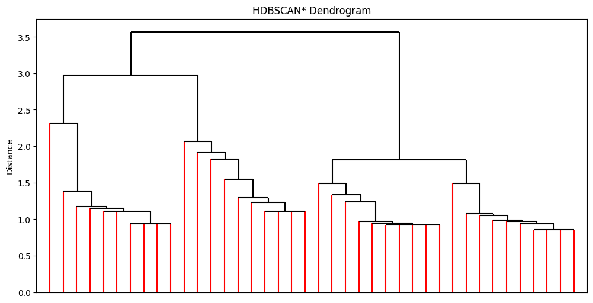
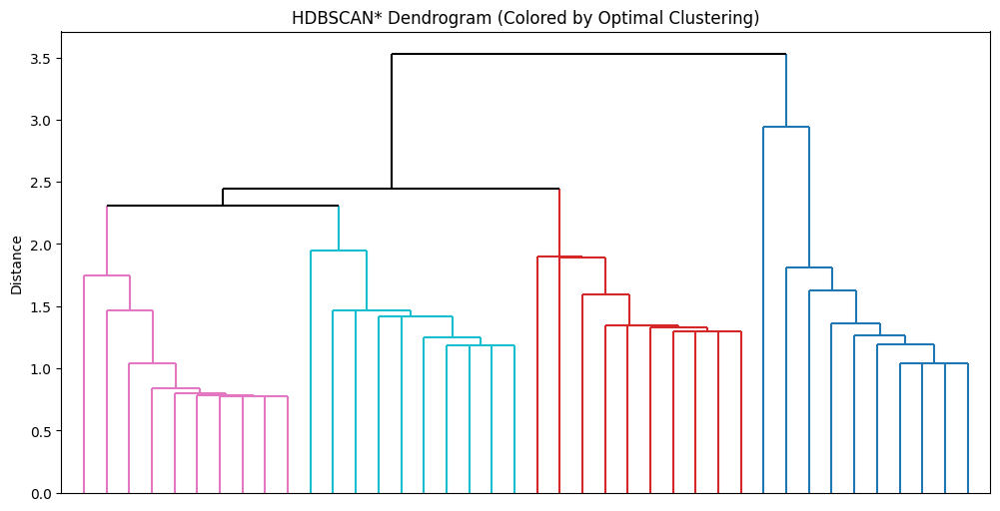
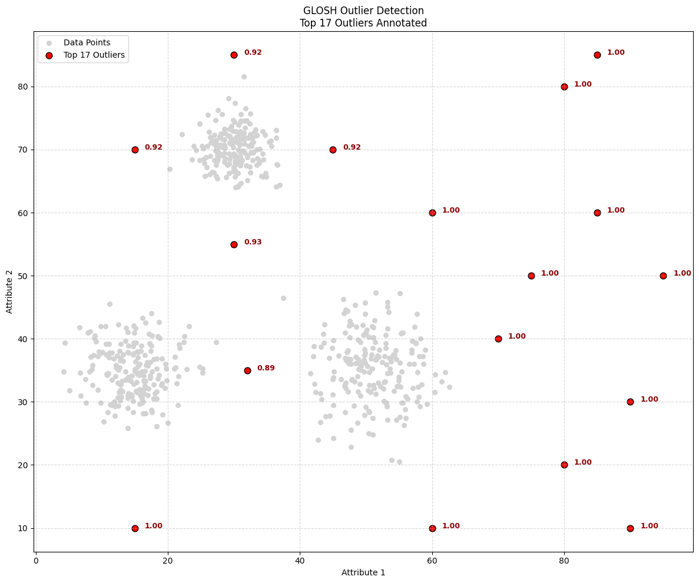
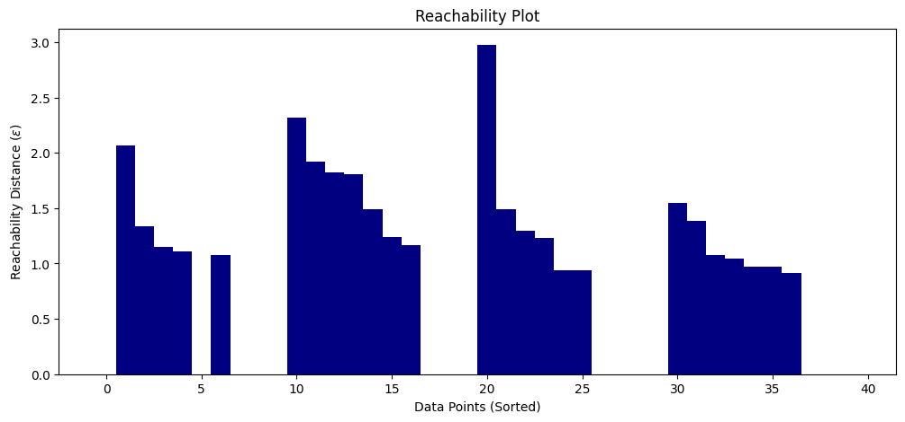
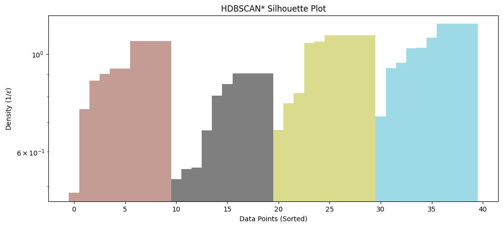

# Hierarchical Density Estimates for Data Clustering, Visualization, and Outlier Detection

This repository contains the implementation of the **HDBSCAN\*** framework (Hierarchical Density-Based Spatial Clustering of Applications with Noise), along with the **GLOSH** outlier detection method.

**Paper Title:** Hierarchical Density Estimates for Data Clustering, Visualization, and Outlier Detection
**Authors:** Ricardo J. G. B. Campello, Davoud Moulavi, Arthur Zimek, and Jörg Sander
**Journal:** ACM Transactions on Knowledge Discovery from Data (TKDD), Vol. 10, No. 1, Article 5 (July 2015)

---

## Summary

This framework introduces an integrated approach for density-based cluster analysis, outlier detection, and data visualization. The core algorithm, **HDBSCAN\***, computes hierarchical estimates of density level sets, strictly following Hartigan's classic statistical model of density-contour clusters.

Unlike traditional DBSCAN, which relies on a single, critical global density threshold (often difficult to tune), HDBSCAN* produces a complete clustering hierarchy composed of all possible density-based clusters for an infinite range of density thresholds. The method constructs this hierarchy by calculating **Mutual Reachability Distances** and building a Minimum Spanning Tree (MST), effectively generalizing DBSCAN to exclude border points and focus on core validity.

This hierarchical structure enables four distinct capabilities:

1.  **Simplified Cluster Trees:** Rather than navigating a complex dendrogram, the algorithm simplifies the hierarchy by identifying "significant" clusters. It uses a measure of **excess of mass** to condense the tree, retaining clusters that persist across density levels while discarding spurious noise.

2.  **Optimal Flat Clustering (Unsupervised & Semi-Supervised):** The framework includes an optimization algorithm to extract a single, non-overlapping partition from the hierarchy.
    * **Unsupervised:** It finds the optimal partition that maximizes the overall **stability** of the extracted clusters.
    * **Semi-Supervised:** If the user provides instance-level constraints (e.g., must-link/cannot-link), the algorithm optimizes a joint objective of constraint satisfaction and cluster stability.

3.  **GLOSH Outlier Detection:** The framework introduces **GLOSH** (Global-Local Outlier Scores from Hierarchies), a measure that detects both global and local outliers simultaneously. Instead of using a fixed neighborhood size, GLOSH calculates outlier scores using a **dynamic reference set** derived from the hierarchy, comparing an object's density to the density of its associated cluster.

4.  **Data Visualization:** The resulting hierarchy can be transformed into various visual formats for exploratory analysis, including reachability plots (similar to OPTICS), detailed dendrograms, and silhouette-like density plots, allowing users to visually assess cluster structure and prominence.

---

## File Structure & Contents

This repository is organized into three main modules corresponding to the primary contributions of the paper:

| File Name | Description | Related Sections |
| :--- | :--- | :--- |
| `HDBSCAN_algorithm.py` | **Core Algorithm & Visualization.**   • Contains the definition, explanation, and implementation of **HDBSCAN\*** (Algorithms 1 & 2).   • Generates the **HDBSCAN\* hierarchy** and simplified cluster tree.   • Includes visualization tools: **Dendrograms**, **Reachability Plots**, and **Silhouette Plots**. | Sec. 3 & 4 |
| `Optimal_non_hierarchical_clustering.py` | **Flat Clustering Extraction.**   • Implements the optimization method to extract a flat, non-overlapping clustering solution from the hierarchy.   • Maximizes the overall **Cluster Stability** (relative excess of mass) for unsupervised learning.   • Can be adapted for semi-supervised constraints (Algorithm 3). | Sec. 5 |
| `Outlier_detection.py` | **GLOSH Outlier Scores.**   • Implements the **GLOSH** (Global-Local Outlier Scores from Hierarchies) method (Algorithm 4).   • Computes scores based on the relationship between an object's density and the density of its associated cluster in the hierarchy. | Sec. 6 |

